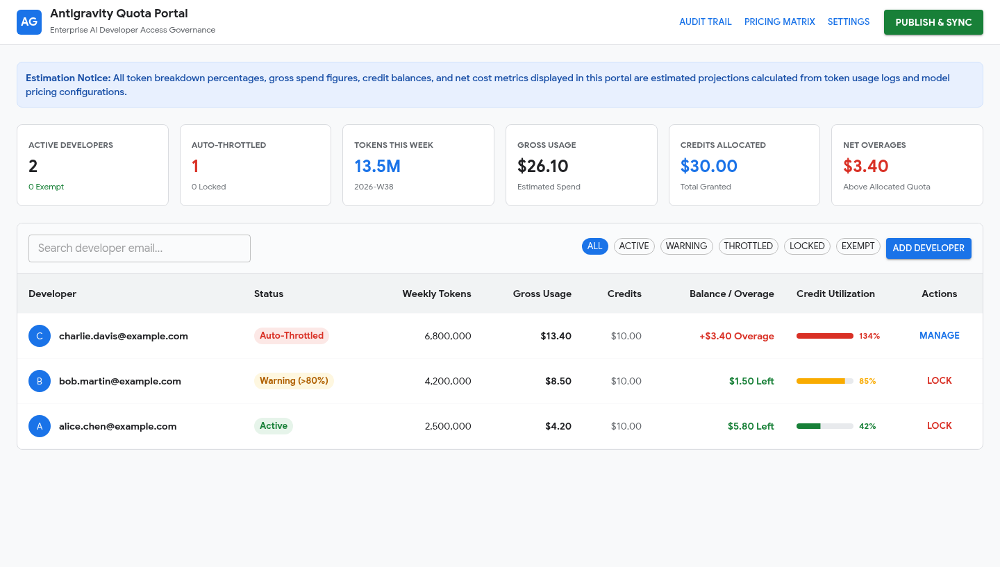
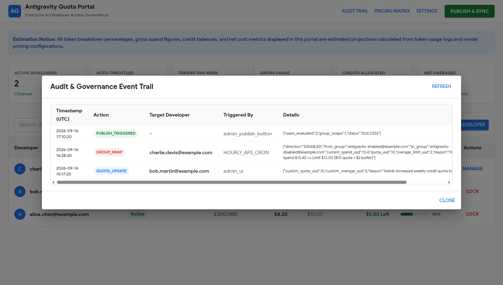
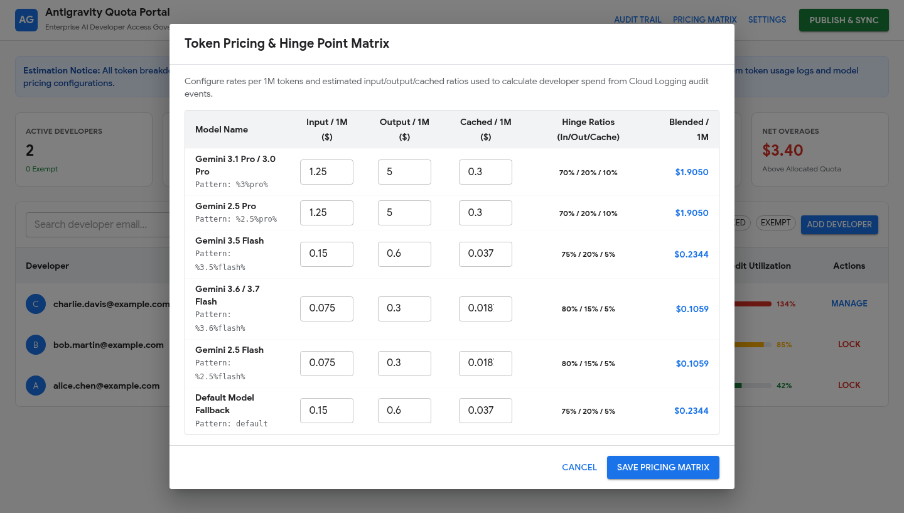
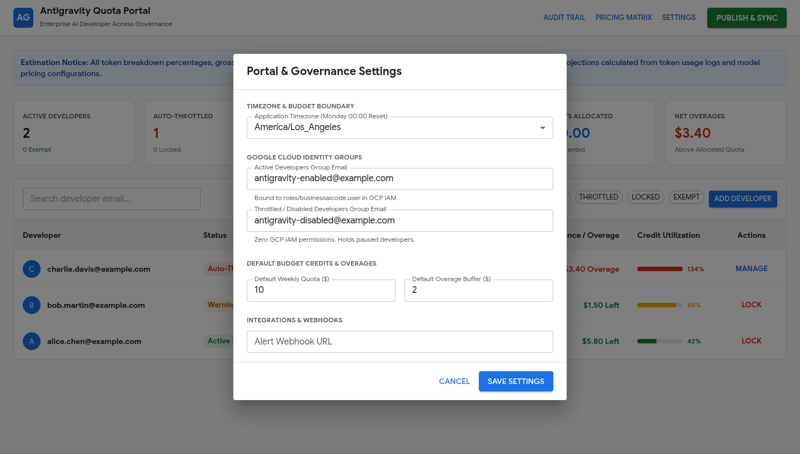
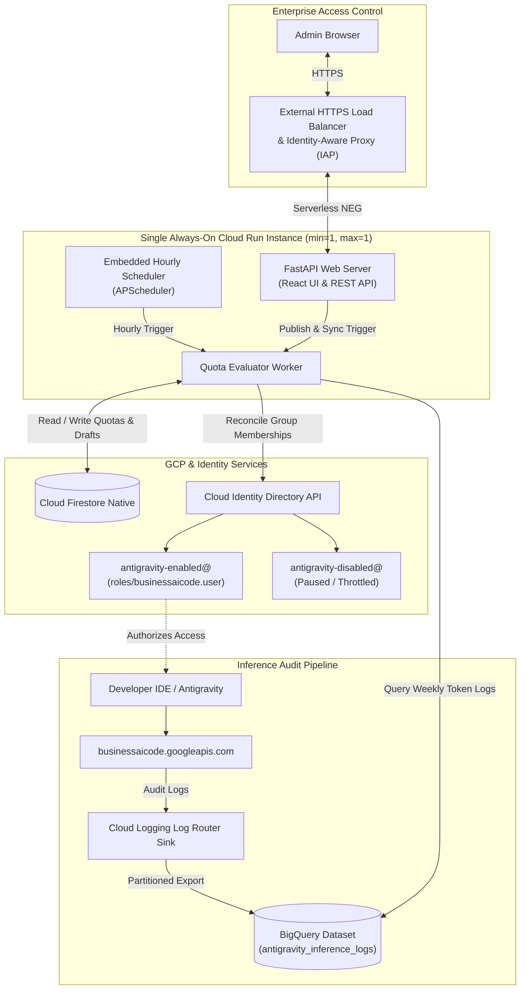

# Antigravity Quota & Usage Management Portal

> [!IMPORTANT]  
> This project is not provided by Google and does not come with any support or warranties. This project serves as a proof of concept for how it's possible implement a quota system with Antigravity.  
> Though functional, you may wish to change the design for increased reliability or feature detail.  

> [!IMPORTANT]  
> Accurate as of 9/16/2026  

> [!NOTE]
> **Independent Quota Approximation Layer**: This project does not integrate with or modify native Gemini Enterprise (GE) quota systems. Gemini Enterprise enforces quota as a pooled entitlement at the GCP project level. This portal operates strictly as an independent management and approximation layer built on top of it, where administrators define per-developer quota targets and enforce access governance via Cloud Identity groups based on estimated usage from BigQuery audit logs.

**What this is**  
- a single-container, deployed to GCP Cloud Run, and Terraform IaC module
- a frontend: React 18 SPA (Vite, TypeScript, Material UI / MUI)
- an API: FastAPI (Python 3.11+) with Uvicorn and embedded APScheduler
- data storage: Cloud Firestore Native (quotas & config) and BigQuery (inference audit logs)

**Why this exists**
- Gemini Enterprise does not allow per user quota management, it is managed per project

**What this is not**
- **Not an integration to native Gemini Enterprise (GE) quota**: This project does not read from, hook into, or modify Google's internal GE quota APIs. It is an **approximation on top of it**, based entirely on an administrator's manual quota policies and token spend models. Implementers are expected to determine the baseline quota each developer receives from their Gemini Enterprise licensing plus any desired overage allowance.
- **Not a GCP billing or invoicing engine**: Because Gemini Enterprise pools quota across the entire GCP project, an individual developer exceeding their credit allowance does not necessarily trigger external Google Cloud billing if total project consumption remains within its pooled entitlement.

**How it works**
- developers are added and removed from Cloud Identity groups (`antigravity-enabled@` and `antigravity-disabled@`) to enable and disable access for Antigravity Quota usage
- an `hourly_quota_evaluator` (and on-demand **Publish & Sync**) performs automated group reconciliation
- **auto-throttled** developers automatically unlock and return to `antigravity-enabled@` on the next hourly evaluation (or instantly upon clicking **Publish & Sync**) whenever an admin increases their quota or overage buffer
- weekly usage resets automatically every Monday at 00:00 (configured timezone), resetting spend to $0 and auto-re-enabling throttled developers
- **manually locked** developers are protected administrative holds that remain disabled across resets until an admin explicitly unlocks them

**Features**
1. **FinOps Credit & Developer Overage Model**:
    * Quotas are allocated as weekly dollar credits (`Q`, default `$10.00`) with remaining credit balance `B_credit = max(0, Q - C_gross)`.
    * Developer overage tracks usage beyond their assigned quota target: `C_overage = max(0, C_gross - Q)` with configurable overage buffer (`O`).
    * Because Gemini Enterprise uses pooled project-level quotas, this metric reflects internal developer consumption exceeding assigned policy targets rather than external Google Cloud billing liability.
    * **Granular Token Telemetry & Precise Pricing**: Calculates gross spend directly from the exact token counts emitted in Antigravity inference logs (`metadata.promptTokenCount`, `metadata.candidatesTokenCount`, `metadata.cachedContentTokenCount`, and `metadata.thoughtsTokenCount`), mapping specific rates for prompt/input, generated output, cached context, and reasoning/thinking tokens (with fallback ratio modeling if only aggregate `totalTokenCount` is present).
    * Timezone-aligned weekly windows (Monday 00:00:00 boundary) with historical snapshots archived to Firestore.
2. **Dual-Group Cloud Identity State Machine**:
    * **`antigravity-enabled@`**: Bound to IAM role `roles/businessaicode.user`.
    * **`antigravity-disabled@`**: Zero IAM permissions (paused developers).
    * **Dynamic Auto-Unthrottle (Quota Expansion)**: If an `Auto-Throttled` developer's quota credits or overage buffer is increased so that $\text{Spend} < \text{Limit}$, the hourly evaluator (or clicking **Publish & Sync**) automatically restores their `ACTIVE` status and moves them back to `antigravity-enabled@` with zero manual group editing required.
    * **Weekly Monday Auto-Reset**: Every Monday at 00:00 (configured enterprise timezone), weekly gross spend resets to `$0.00` and all `Auto-Throttled` developers are automatically re-enabled into `antigravity-enabled@`.
    * **Administrative Lock Protection**: Distinguishes automated spend limits from `MANUALLY_DISABLED` (administrative locks that are protected from Monday resets and remain locked until explicitly unlocked by an admin).
    * **Quota Exemption**: Supports `is_exempt` to bypass quota limits for leads/VIPs while retaining full usage analytics.
3. **Developer Onboarding & Synthetic Discovery**:
    * **Synthetic Discovery**: Automatically discovers active developers from BigQuery inference logs and registers them with default weekly quota credits.
    * **Manual Pre-provisioning**: Admins can pre-provision developers in the UI or via REST API with custom quotas prior to their first prompt.
4. **Deferred Sync with Instant Publish**:
    * Admins can edit developer quotas, toggle exemptions, and update pricing matrix in drafts.
    * Clicking **"Publish & Sync"** executes an instant in-process evaluation and reconciles Cloud Identity groups in real-time (<2s), immediately unthrottling developers who received quota increases without waiting for the next cron cycle.
    * Built-in `APScheduler` runs hourly evaluation as an automated safety net.
5. **Material Design 3 (MUI) Dashboard**:
    * Pinned legal/accounting estimation disclaimer banner.
    * Real-time KPI summary cards (Active Developers, Auto-Throttled, Weekly Tokens, Gross Usage, Credits Allocated, Net Overages).
    * Sortable, filterable developer table with color-coded credit utilization progress bars and contextual action buttons (Lock, Unlock, Manage).
    * Interactive slide-out drawer with financial ledger, model token distribution, and custom quota controls.
    * Governance audit trail log viewer and model pricing matrix editor.
6. **Enterprise Security & Automated Infrastructure**:
    * Provisions APIs, BigQuery dataset, Cloud Logging Sink, Firestore Native Database, Service Account with least-privilege IAM, Artifact Registry repository, and Cloud Run v2 service in the same GCP project via Terraform (`terraform/`).
    * **Zero-Trust Access with IAP**: Full External HTTPS Application Load Balancer integrated with Google Identity-Aware Proxy (IAP) and least-privilege IAM for secure, browser-based SSO.
    * **Automated `sslip.io` DNS & Managed SSL**: Automatically provisions Google-managed SSL certificates using derived `sslip.io` hostnames (e.g. `34-36-64-200.sslip.io`) without requiring a custom domain, with optional custom domain override support.
    * **Local Sandbox & Mock Mode**: Runs out-of-the-box with `USE_MOCK_SERVICES=true` without requiring live GCP credentials.

---

## Visual Tour & Interface

### Developer Access & Quota Dashboard


### Audit & Governance Event Trail
Real-time dual-written audit trail tracking group swaps, manual locks, admin publishes, and quota updates.


### Token Pricing & Hinge Point Matrix
Dynamic per-million token rates and input/output/cached hinge point ratios for accurate gross spend estimation.


### Portal & Governance Settings
Configurable weekly budget boundaries, application timezones, Cloud Identity groups, and alert webhook endpoints.


---

## Architecture Overview



---

## Antigravity Inference Log Schema & Token Telemetry

Inference telemetry is exported from Cloud Logging to BigQuery via the log sink from `businessaicode.googleapis.com/inference_response`. Each log entry provides a structured `jsonpayload_v1_inferenceresponselog.metadata` payload containing granular token telemetry per request:

```json
"metadata": {
  "totalTokenCount": 8920,
  "promptTokenCount": 7450,
  "candidatesTokenCount": 1470,
  "cachedContentTokenCount": 256,
  "thoughtsTokenCount": 0,
  "truncated": false
}
```

### Telemetry Field Breakdown

| Log Field | Type | Description & Billing Mapping |
| :--- | :---: | :--- |
| `promptTokenCount` | `int64` | **Input / Prompt Tokens**: Total input tokens submitted in the request (prompts, instructions, tool declarations). Billed at model input price $P_{\text{in}}$. |
| `candidatesTokenCount` | `int64` | **Output / Candidate Tokens**: Generation tokens produced by the model across response candidates. Billed at model output price $P_{\text{out}}$. |
| `cachedContentTokenCount` | `int64` | **Cached Context Tokens**: The subset of prompt tokens served from Gemini Context Caching. Billed at the discounted cache read rate $P_{\text{cached}}$ rather than full input price. |
| `thoughtsTokenCount` | `int64` | **Reasoning / Thinking Tokens**: Internal reasoning/chain-of-thought tokens produced during inference (e.g. Gemini 2.0 Flash Thinking / Gemini 3 Pro). Billed under output token pricing. |
| `totalTokenCount` | `int64` | **Total Token Volume**: Combined token sum for the inference call: $\text{promptTokenCount} + \text{candidatesTokenCount} = \text{totalTokenCount}$ (e.g. $7450 + 1470 = 8920$). |
| `truncated` | `bool` | **Truncation Flag**: Indicates whether generation was truncated due to token limit (`max_output_tokens`) or safety cutoff. |

### Granular Spend Calculation

Using this telemetry, exact gross spend is determined without relying on arbitrary synthetic ratios:

$$\text{Effective Input Tokens} = \max(0, \text{promptTokenCount} - \text{cachedContentTokenCount})$$
$$\text{Cached Tokens} = \text{cachedContentTokenCount}$$
$$\text{Output Tokens} = \text{candidatesTokenCount} + \text{thoughtsTokenCount}$$

$$C_{\text{gross}} = \left( \frac{\text{Effective Input}}{1{,}000{,}000} \times P_{\text{in}} \right) + \left( \frac{\text{Cached}}{1{,}000{,}000} \times P_{\text{cached}} \right) + \left( \frac{\text{Output}}{1{,}000{,}000} \times P_{\text{out}} \right)$$

> [!NOTE]  
> If an older log record or summarized entry only provides `totalTokenCount` (with granular sub-counts missing or null), the system gracefully falls back to the per-model estimated ratios ($w_{\text{in}}, w_{\text{out}}, w_{\text{cached}}$) defined in the model pricing matrix.

---

## Project Structure

```
antigravity-quota-portal/
├── SPECIFICATION.md
├── pyproject.toml               # Python package configuration
├── Dockerfile                   # Multi-stage container build
├── Containerfile                # Podman container definition
├── README.md
├── terraform/                   # Terraform IaC Module
│   ├── main.tf                  # Providers & APIs
│   ├── bigquery.tf              # Dataset & Cloud Logging Sink
│   ├── firestore.tf             # Firestore Native Database
│   ├── iam.tf                   # Service Account & Least-Privilege IAM
│   ├── cloud_run.tf             # Artifact Registry & Cloud Run v2 Service
│   ├── lb.tf                    # External HTTPS Load Balancer & IAP
│   ├── variables.tf             # Inputs
│   ├── outputs.tf               # Resource endpoints
│   └── terraform.tfvars.example # Example configuration
├── scripts/
│   ├── run_local_demo.py        # Local sandbox runner (seeds 3 demo users)
│   ├── seed_demo_data.py        # REST API demo user seeder script
│   ├── capture_screenshot.py    # Headless Chrome dashboard screenshot capture
│   ├── build_and_push.sh        # Podman build & push script
│   └── deploy_terraform.sh      # Terraform deploy script
├── frontend/                    # Material UI React Application
│   ├── package.json
│   ├── vite.config.ts
│   ├── index.html
│   └── src/
│       ├── main.tsx
│       ├── App.tsx
│       ├── theme.ts             # Google Cloud Material 3 Theme
│       ├── components/          # UI Components
│       └── services/api.ts      # REST API Client
├── app/
│   ├── main.py                  # FastAPI Application & APScheduler
│   ├── config.py                # Environment configuration
│   ├── audit/                   # GCP Cloud Logging audit emitter & mock
│   ├── core/                    # Cost math, timezone engine & state machine
│   ├── db/                      # Firestore client & Mock DB
│   ├── bq/                      # BigQuery client & Mock BQ
│   ├── identity/                # Cloud Identity client & Mock Identity
│   ├── api/                     # REST API routes
│   └── static/                  # Production static SPA bundle
└── tests/                       # Unit & Integration Tests
    ├── test_cost_model.py
    ├── test_timezone.py
    ├── test_state_machine.py
    ├── test_evaluator.py
    ├── test_audit_gcp.py
    └── test_api.py
```

---

## Local Development & Testing

### Running Tests
```bash
# Run backend pytest suite
uv run pytest -v tests/
```

### Running Locally in Mock Sandbox Mode

#### Option A: Dedicated 3-User Sandbox Runner (Recommended)
Launches the portal pre-seeded with **3 users** demonstrating each quota lifecycle state (Active Normal, Active Warning, and Auto-Throttled):
```bash
uv run scripts/run_local_demo.py
```
Open [http://localhost:8080](http://localhost:8080) to interact with the dashboard.

#### Option B: Standard Uvicorn / Podman Runner
```bash
# Direct via Python / uv
export USE_MOCK_SERVICES=true
uv run uvicorn app.main:app --reload --port 8080

# Or via Podman container
podman build -t antigravity-quota-portal:local .
podman run -d -p 8080:8080 antigravity-quota-portal:local
```

#### Seeding Users to an Already Running Portal
If the portal is already running, insert demo users at any time via the REST API helper script:
```bash
uv run scripts/seed_demo_data.py --url http://localhost:8080
```

#### Capturing UI Screenshots Headless
To automatically launch the 3-user mock sandbox, render the Material UI interface in headless Chrome, and capture fresh high-resolution screenshots to `docs/images/` (`portal_dashboard.png`, `portal_audit_log.png`, `portal_pricing_matrix.png`, and `portal_settings.png`):
```bash
uv run scripts/capture_screenshot.py
```

---

## Container Build & GCP Deployment

### Step 1: Provision Artifact Registry with Terraform
Target the repository resource first to enable required Google Cloud APIs and provision the Docker repository in Artifact Registry:
```bash
cd terraform
cp terraform.tfvars.example terraform.tfvars
# Edit terraform.tfvars with your GCP project ID, region, and group emails

terraform init
terraform apply -target=google_artifact_registry_repository.docker_repo
```

### Step 2: Build and Push Container with Podman
With the repository live, build the container image and push it to Artifact Registry:
```bash
cd ..
./scripts/build_and_push.sh <YOUR_PROJECT_ID> us-central1 latest
```

### Step 3: Deploy Full Infrastructure
Provision Cloud Run v2, Cloud Firestore Native, BigQuery dataset and sink, External Application Load Balancer with `sslip.io` SSL certificate, and Identity-Aware Proxy (IAP):
```bash
cd terraform
terraform apply
```

---

## API Endpoints Reference

| Endpoint | Method | Description |
| :--- | :---: | :--- |
| `/api/health` | `GET` | Service health status and runtime configuration |
| `/api/users` | `GET` | List developers with filtering, search, and sorting |
| `/api/users/{email}` | `GET` | Get developer usage breakdown and financial ledger |
| `/api/users` | `POST` | Pre-provision new developer |
| `/api/users/{email}` | `PATCH` | Update quota limits, overage buffer, or exemption |
| `/api/users/{email}/lock` | `POST` | Toggle manual access lock |
| `/api/config` | `GET` / `PUT` | View or update global settings & group emails |
| `/api/config/pricing` | `GET` / `PUT` | View or update model token pricing matrix |
| `/api/evaluator/kpis` | `GET` | Retrieve aggregate portal KPI metrics |
| `/api/evaluator/publish` | `POST` | Execute instant "Publish & Sync" evaluation |
| `/api/audit` | `GET` | Fetch governance audit trail events |

---

## License

Distributed under the Apache License, Version 2.0. See [`LICENSE`](LICENSE) for more information.

---

<p align="center">
  <sub>Built with Antigravity CLI and Gemini 3.8 Flash High</sub>
</p>


