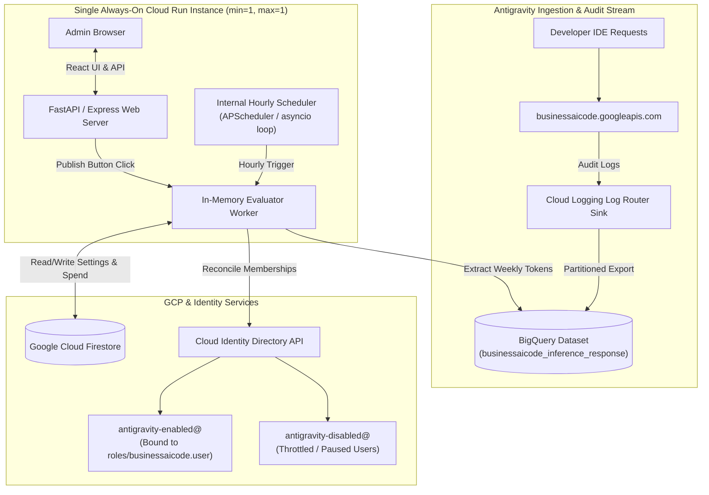
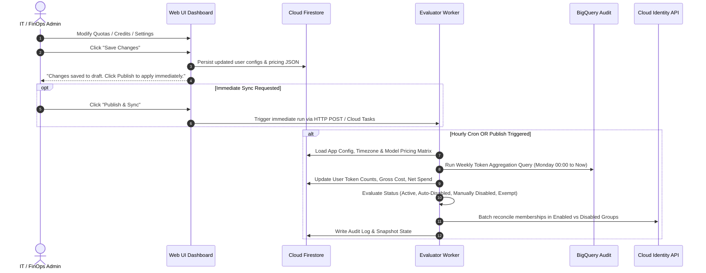
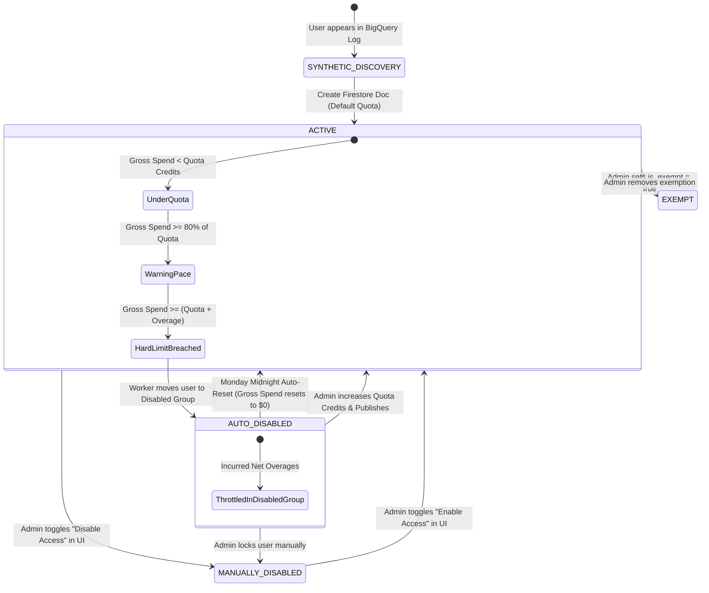
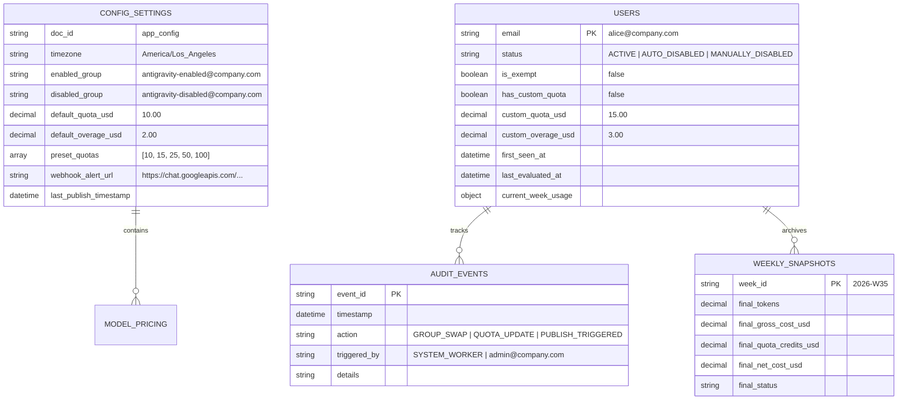

# Technical Design Document & Feature Specification: Antigravity Quota & Usage Management Portal

**Author**: Alan Blythe  
**Status**: APPROVED ARCHITECTURAL SPECIFICATION  
**Target Platform**: Google Cloud Platform (Single Always-On Cloud Run Instance, Firestore, BigQuery, Cloud Identity)

---

## 1. Executive Summary & Objective

The **Antigravity Quota & Usage Management Portal** provides fine-grained visibility, credit tracking, cost estimation, and automated access governance for developer access to Google Antigravity (Gemini Enterprise AI Developer Tools).

> [!NOTE]
> **Independent Quota Approximation Layer**: This system does not integrate with or modify native Gemini Enterprise (GE) quota systems. Gemini Enterprise enforces quota as a pooled entitlement at the GCP project level. This portal operates strictly as an independent management and approximation layer built on top of it, where administrators define per-developer quota targets and enforce access governance via Cloud Identity groups based on estimated usage from BigQuery audit logs.

To minimize architectural complexity and infrastructure overhead, the system is deployed as a **single, always-on minimal Cloud Run instance** (`min-instances: 1`, `max-instances: 1`, 1 vCPU, 512MB RAM). This single instance hosts:
1. **The Web Dashboard & REST API**: Instantaneous page loads with zero cold starts for admin users.
2. **The Embedded Background Worker**: Runs an internal scheduler (e.g., Python `APScheduler` / `asyncio` loop) to evaluate quotas hourly, completely eliminating the need for external Cloud Scheduler cron jobs.
3. **Instant Publish Handler**: Exposes an in-process trigger invoked whenever the admin clicks "Publish & Sync" in the UI.



---

## 2. Financial Ledger, Cost Calculation & Credit Mechanics

### 2.1 The Credit vs. Net Cost Model
In Antigravity enterprise deployments, user quotas are distributed as **credit allocations**. To provide accurate FinOps reporting, the system calculates both gross usage and net liability:

1. **Gross Estimated Cost ($C_{\text{gross}}$)**:
   $$\text{Blended Rate Per 1M Tokens } (R_{\text{blended}}) = (w_{\text{in}} \cdot P_{\text{in}}) + (w_{\text{out}} \cdot P_{\text{out}}) + (w_{\text{cache}} \cdot P_{\text{cache}})$$
   $$C_{\text{gross}} = \frac{T_{\text{total}} \times R_{\text{blended}}}{1,000,000}$$

2. **Allocated Quota Credits ($Q$)**:
   The weekly credit amount granted to the developer (e.g. \$10.00).

3. **Remaining Credit Balance ($B_{\text{credit}}$)**:
   $$B_{\text{credit}} = \max(0, Q - C_{\text{gross}})$$

4. **Net Cost / Developer Overage ($C_{\text{net}}$)**:
   $$C_{\text{net}} = \max(0, C_{\text{gross}} - Q)$$
   *(Note: Because Gemini Enterprise utilizes pooled project-level quotas, $C_{\text{net}}$ measures an individual developer's consumption exceeding their allocated quota target, rather than external GCP billing liability.)*

5. **Throttling Condition**:
   A user exceeds allowed usage when their Gross Cost exceeds their Quota Credits plus their allowed Overage Buffer ($O$):
   $$\text{Throttled if: } C_{\text{gross}} \ge Q + O \quad \iff \quad C_{\text{net}} \ge O$$

### 2.2 Global Estimation Disclaimer
To avoid visual clutter while maintaining legal/accounting compliance, the application features a **single, prominent disclaimer banner** pinned to the dashboard header / footer:

> ℹ️ **Estimation Notice**: *All token breakdowns, cost calculations, credit balances, and spend metrics displayed in this portal are estimated projections calculated from raw token counts and configured model pricing assumptions.*

---

## 3. Core Architecture & Workflow Model

### 3.1 The "Save" vs. "Publish" Admin Lifecycle

To provide operational safety and batch management, administrative actions in the web UI follow a **Deferred Sync with Instant Publish** pattern:



1. **Save Changes**: Persists user quota overrides, overage amounts, exemptions, and model pricing directly to Firestore without immediately invoking external APIs.
2. **Publish & Sync**: Immediately triggers the in-process background evaluator worker to re-run the BigQuery consumption query, re-calculate gross vs. net spend, and reconcile Cloud Identity groups in real-time.
3. **Embedded Scheduled Run**: The container's internal background scheduler (`APScheduler` / `asyncio` loop) triggers the evaluator worker every hour as an automated background safety net without requiring external cron infrastructure.

---

## 4. Dual-Group Identity State Machine

### 4.1 Group Definitions & IAM Roles

| Group Email | GCP IAM Role Binding | Purpose |
| :--- | :--- | :--- |
| `antigravity-enabled@yourcompany.com` | `roles/businessaicode.user` | **Active Developers**: Grants permission to run Antigravity inference. |
| `antigravity-disabled@yourcompany.com` | *None* | **Throttled / Paused Developers**: Zero IAM privileges. Tracks all inactive developers for audit and notification lists. |

### 4.2 State Definitions & Transitions



### 4.3 State Matrix & Evaluator Action Rules

| State / Flag | Group Location | Evaluator Action on Quota Breach | Monday 00:00 Reset Behavior |
| :--- | :--- | :--- | :--- |
| **`ACTIVE`** (`is_exempt: false`) | `antigravity-enabled@` | If `C_gross >= Q + O`: Move to `antigravity-disabled@`, set state to `AUTO_DISABLED`. | Reset weekly gross token spend to `$0.00`. Credit balance resets to `Q`. Remain in `antigravity-enabled@`. |
| **`AUTO_DISABLED`** | `antigravity-disabled@` | User is throttled. If Admin increases `Q` such that `C_gross < Q + O`: Move to `antigravity-enabled@`, set state to `ACTIVE`. | **Auto-Re-enable**: Move user back to `antigravity-enabled@`, set state to `ACTIVE`. |
| **`MANUALLY_DISABLED`** | `antigravity-disabled@` | Manual lock. Evaluator never modifies group. | **Protected**: Ignored by Monday reset. User remains in `antigravity-disabled@`. |
| **`is_exempt: true`** | `antigravity-enabled@` | Quota checks bypassed. Usage is tracked and displayed, but user is never throttled. | Reset weekly counters. User remains in `antigravity-enabled@`. |

---

## 5. Token Cost Modeling Engine & "Hinge Points"

### 5.1 Per-Model Configuration Schema

```json
{
  "models": {
    "gemini-3-pro": {
      "display_name": "Gemini 3.1 Pro / 3.0 Pro",
      "log_pattern": "%3%pro%",
      "input_price_per_million": 1.25,
      "output_price_per_million": 5.00,
      "cached_price_per_million": 0.30,
      "estimated_input_ratio": 0.70,
      "estimated_output_ratio": 0.20,
      "estimated_cached_ratio": 0.10
    },
    "gemini-2.5-pro": {
      "display_name": "Gemini 2.5 Pro",
      "log_pattern": "%2.5%pro%",
      "input_price_per_million": 1.25,
      "output_price_per_million": 5.00,
      "cached_price_per_million": 0.30,
      "estimated_input_ratio": 0.70,
      "estimated_output_ratio": 0.20,
      "estimated_cached_ratio": 0.10
    },
    "gemini-3.5-flash": {
      "display_name": "Gemini 3.5 Flash",
      "log_pattern": "%3.5%flash%",
      "input_price_per_million": 0.15,
      "output_price_per_million": 0.60,
      "cached_price_per_million": 0.0375,
      "estimated_input_ratio": 0.75,
      "estimated_output_ratio": 0.20,
      "estimated_cached_ratio": 0.05
    },
    "gemini-3.6-flash": {
      "display_name": "Gemini 3.6 / 3.7 Flash",
      "log_pattern": "%3.6%flash%",
      "input_price_per_million": 0.075,
      "output_price_per_million": 0.30,
      "cached_price_per_million": 0.01875,
      "estimated_input_ratio": 0.80,
      "estimated_output_ratio": 0.15,
      "estimated_cached_ratio": 0.05
    },
    "gemini-2.5-flash": {
      "display_name": "Gemini 2.5 Flash",
      "log_pattern": "%2.5%flash%",
      "input_price_per_million": 0.075,
      "output_price_per_million": 0.30,
      "cached_price_per_million": 0.01875,
      "estimated_input_ratio": 0.80,
      "estimated_output_ratio": 0.15,
      "estimated_cached_ratio": 0.05
    },
    "default_fallback": {
      "display_name": "Default Model Fallback",
      "log_pattern": "default",
      "input_price_per_million": 0.15,
      "output_price_per_million": 0.60,
      "cached_price_per_million": 0.0375,
      "estimated_input_ratio": 0.75,
      "estimated_output_ratio": 0.20,
      "estimated_cached_ratio": 0.05
    }
  }
}
```

---

## 6. Timezone & Weekly Boundary Engine

### 6.1 Timezone Normalization
* The application stores a single global **App Timezone** (e.g. `America/Los_Angeles`, `America/New_York`, or `UTC`).
* **Weekly Window**: Begins strictly at **Monday 00:00:00** and ends at **Sunday 23:59:59** in the configured application timezone.
* All developers across all global regions are measured against this unified weekly budget boundary.

### 6.2 BigQuery Parametrized Extraction Query

```sql
-- Parametrized BigQuery Usage Aggregation
-- @start_timestamp_utc and @end_timestamp_utc are calculated from App Timezone (Monday 00:00 to Now)
WITH raw_events AS (
  SELECT
    timestamp,
    REPLACE(labels.user_id, 'user:', '') AS user_email,
    COALESCE(labels.model, 'gemini-3.6-flash') AS model_name,
    COALESCE(
      SAFE_CAST(jsonpayload_v1_inferenceresponselog.metadata.totalTokenCount AS INT64),
      SAFE_CAST(jsonpayload_v1_inferenceresponselog.metadata.totaltokencount AS INT64),
      0
    ) AS total_tokens
  FROM
    `{{PROJECT_ID}}.{{DATASET_NAME}}.businessaicode_googleapis_com_inference_response`
  WHERE
    timestamp >= @start_timestamp_utc
    AND timestamp <= @end_timestamp_utc
)
SELECT
  user_email,
  model_name,
  COUNT(1) AS request_count,
  SUM(total_tokens) AS token_count,
  MAX(timestamp) AS last_active
FROM
  raw_events
WHERE
  user_email IS NOT NULL
  AND NOT ENDS_WITH(user_email, '.gserviceaccount.com')
GROUP BY
  user_email,
  model_name;
```

---

## 7. Firestore Database Schema

Firestore stores the application settings, user configurations, weekly consumption, and credit ledgers.



### 7.1 Firestore User Document (`users/{user_email}`)

```json
{
  "email": "alice@yourcompany.com",
  "status": "ACTIVE",
  "is_exempt": false,
  "has_custom_quota": true,
  "custom_quota_usd": 20.00,
  "custom_overage_usd": 5.00,
  "current_week": {
    "week_id": "2026-W35",
    "total_tokens": 3450000,
    "total_requests": 240,
    "gross_spend_usd": 14.85,
    "quota_credits_usd": 20.00,
    "remaining_credit_usd": 5.15,
    "net_billable_cost_usd": 0.00,
    "overage_buffer_usd": 5.00,
    "spend_breakdown": {
      "input_spend_usd": 10.40,
      "output_spend_usd": 3.85,
      "cached_spend_usd": 0.60
    },
    "tokens_by_model": {
      "gemini-3-pro": 2500000,
      "gemini-3.6-flash": 950000
    },
    "credit_utilization_percentage": 74.25,
    "last_active": "2026-08-27T11:42:10Z"
  },
  "created_at": "2026-08-01T09:00:00Z",
  "updated_at": "2026-08-27T12:00:00Z"
}
```

---

## 8. Web Application UI/UX Specification

### 8.1 Global Estimation Disclaimer & Top Banner
* **Single Disclaimer**: Displayed once at the top/footer of the portal:
  * *"ℹ️ All token breakdown percentages, gross spend figures, and net cost metrics are estimated projections calculated from token usage logs and model pricing configurations."*

### 8.2 Main Dashboard (User Management Table)

*   **KPI Summary Chips**:
    *   `Active Developers`: 178
    *   `Auto-Throttled`: 4
    *   `Total Tokens This Week`: 128.4M
    *   `Total Gross Usage`: \$1,420.50 *(Estimated)*
    *   `Total Credits Allocated`: \$1,780.00
    *   `Total Net Overages`: \$64.20 *(Billable Spend)*

*   **Sortable Interactive Table Columns**:

| Column Name | Data Type | Sortable | Display / Visual Elements |
| :--- | :--- | :---: | :--- |
| **User** | String | Yes | Gravatar/Avatar + Developer Email (`user@company.com`) |
| **Status** | Enum | Yes | 🟢 `Active` \| 🟡 `Warning (>80%)` \| 🔴 `Auto-Throttled` \| 🔒 `Locked` \| ⚪ `Exempt` |
| **Total Tokens** | Integer | Yes | Formatted with commas (`3,450,000`) |
| **Gross Usage** | Currency | Yes | **$14.85** *(Total token value)* |
| **Quota Credits** | Currency | Yes | **$20.00** *(Granted allowance)* |
| **Credit Balance / Net Overage** | Currency | Yes | If `C_gross <= Q`: **$5.15 Left** 🟢<br>If `C_gross > Q`: **+$2.40 Net Overage** 🔴 |
| **Credit Utilization** | Percentage | Yes | Progress Bar with dynamic color (`<80% Green`, `80-100% Yellow`, `>100% Red`) |
| **Last Active** | Relative Time | Yes | "12 minutes ago" |
| **Actions** | Action Menu | No | `[ Quick Edit Quota ]` \| `[ Disable / Lock ]` \| `[ Set Exempt ]` |

### 8.3 User Detail Slide-out Drawer
Clicking any user row opens a slide-out drawer containing:
1.  **Credit & Cost Ledger**:
    *   **Gross Token Value**: \$14.85
    *   **Allocated Credits**: \$20.00
    *   **Remaining Credit Balance**: \$5.15
    *   **Net Billable Overage**: \$0.00
2.  **Usage & Cost Donut Chart**: Breakdown by model (`Gemini 3 Pro` vs `Gemini 3.6 Flash`).
3.  **Hinge Point Breakdown**: Estimated Input vs Output vs Cached token volume and dollar amounts.
4.  **Quota Configuration Form**:
    *   Radio buttons for presets (\$10, \$15, \$25, \$50, \$100) or Custom Text Input (\$XX.XX).
    *   Overage Buffer Input (\$XX.XX).
    *   `Exempt from Quota Controls` Checkbox.
    *   `Manually Lock / Disable User` Toggle.
    *   `[ Save Draft ]` Button.

---

## 9. Security & Minimal Privilege IAM Model

| Identity / Service Account | Granted IAM Roles | Scoped Resource | Purpose |
| :--- | :--- | :--- | :--- |
| **Cloud Run Unified SA** (`antigravity-quota-portal@...`) | `roles/bigquery.dataViewer`<br>`roles/bigquery.jobUser` | BigQuery Dataset & Project | Reads inference audit logs. |
| **Cloud Run Unified SA** (`antigravity-quota-portal@...`) | `roles/datastore.user` | Cloud Firestore | Reads/writes app configuration, user limits, and spend cache. |
| **Cloud Run Unified SA** (`antigravity-quota-portal@...`) | Cloud Identity **Group Manager** | `antigravity-enabled@`<br>`antigravity-disabled@` | Swaps group memberships via Google Cloud Identity API. **Zero GCP project IAM admin rights.** |

---

## 10. Summary & Sign-off

The specification now fully formalizes:
1. **The Credit vs. Overage Model**: User quotas are treated as granted credits. Overage accumulates when gross usage exceeds the quota ($C_{\text{gross}} - Q$), tracking internal developer overage against policy targets rather than external pooled billing.
2. **Unified Estimation Disclaimer**: Prominently presented at the application level rather than fragmenting every metric on the page.
3. **Dual-Group Cloud Identity Model**: Complete state transitions across `ACTIVE`, `AUTO_DISABLED`, `MANUALLY_DISABLED`, and `is_exempt`.
4. **Save & Publish Workflow**: Full admin control over draft changes with optional instant sync or hourly scheduled reconciliation.
